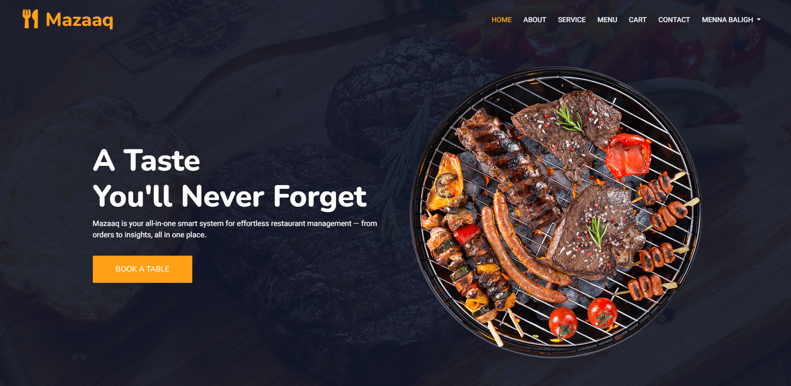
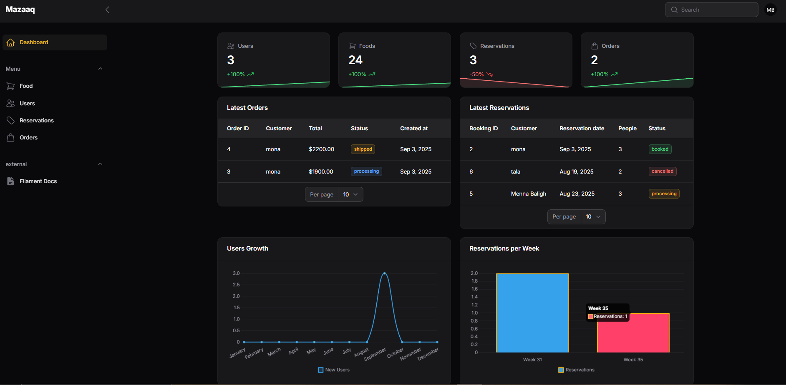

# Mazaaq 🍽️

<p align="center">
  
</p>

[](https://github.com/Menna-Baligh/Mazaaq)
[](https://github.com/Menna-Baligh/Mazaaq)
[]()
[]()
[]()
[]()
[]()
[]()
[]()


## 📝Project Overview

**Mazaaq** is a full-featured restaurant management application that consists of two main parts:

1. **🍽️Customer Section**
   - Menu browsing and food selection
   - Table reservation system
   - Shopping cart & order placement
   - Payment integration using **PayPal API**
   - Contact form for inquiries
   - Review submission for completed reservations
   > **Note:** Screens below are samples; full features will be visible when running the project.



2. **🛡️Admin Panel**
   - Built with **Filament Admin**
   - Fully managed resources for users, foods, orders, and reservations
   - Dashboard with statistics and charts
   > **Note:** Screens below are illustrative only; full functionalities appear when the project is running.




---

## 🛠 Tools & Technologies Used

* **Languages:** PHP, JavaScript, SQL
* **Frameworks / Libraries:** Laravel, Bootstrap
* **Package Managers:** Composer, NPM
* **Database:** MySQL
* **Admin Panel:** Filament
* **Payment:** PayPal API

---

## 🚀 Project Features

- User authentication and registration
- Dynamic food menu with images, price, and stock
- Table booking system with date and people count
- Shopping cart for multiple food orders
- PayPal payment integration for secure transactions
- Review system tied to reservations
- Admin panel for managing all resources with Filament
- Charts and statistics for orders, bookings, users, and popular foods

---

## ⚡ Installation & Setup

1. Clone the repository:

```bash
git clone https://github.com/Menna-Baligh/Mazaaq.git
cd mazaaq
```

2. Install PHP dependencies using Composer:

```bash
composer install
```

3. Install frontend dependencies using NPM:

```bash
npm install
npm run dev
```

4. Copy `.env.example` to `.env` and set up your database and mail configuration:

```bash
cp .env.example .env
php artisan key:generate
```


5. Start the local development server:

```bash
php artisan serve
```

Now you can visit `http://127.0.0.1:8000` to see the application in action as a regular user and explore its features.  
If you want to access the admin panel, go to `http://127.0.0.1:8000/admin` and log in with an admin account.

---


